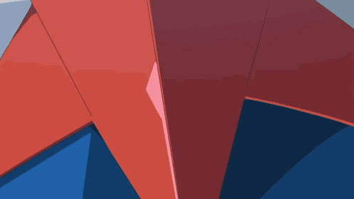

 

## About

I am a **B.Tech Computer Science and Engineering** student at **MNNIT Allahabad** (Batch of 2029) with a passion for generative AI, and competitive programming. My core interests lie in building end-to-end systems, agentic AI pipelines, and real-time backends.

I write C++ for contests and Python/JS for systems I want to understand under the hood. I'd rather know *why* a technique works than just that it does which is how a tree-search assignment turned into a custom Go engine, and how building a "chat with a YouTube video" tool became a deep dive into why naive transcript chunking throws away meaning.

**Codeforces Specialist** · **LeetCode Knight** · **CodeChef 2★ (1500+)**

 

## Education

- **B.Tech in Computer Science and Engineering**  
  *Motilal Nehru National Institute of Technology (MNNIT) Allahabad, Prayagraj* | 2025 – Present | **CGPA: 8.98**
- **Class XII (CBSE)**  
  *Modern Public School, Jhansi, U.P.* | 2024 – 2025 | **Percentage: 93%**
- **Class X (CBSE)**  
  *Sun International School, Jhansi, U.P.* | 2022 – 2023 | **Percentage: 94.8%**

 

## What I'm building

### Verora - Personal AI Assistant &nbsp;·&nbsp; *in progress*

Agentic personal AI assistant built in Python

- Core agent module orchestrates logic, with pluggable tools for extended capabilities
- watchers run in the background for context-aware, event-triggered actions
- state_store maintains persistent memory/state across sessions

[**Repository →**](https://github.com/SANSKAR-D/verora-personal-ai-assistant)

 

---

### Agentic AI ChatBot & Blog Generator

Full-stack, multi-agent AI application built with **FastAPI, LangGraph, React, and PostgreSQL**.

- Hybrid RAG search combining FAISS (dense) and BM25 (sparse) via Reciprocal Rank Fusion
- Multi-agent blog generation pipeline (map-reduce / fan-out-fan-in) with parallel section-writing agents and web research via Tavily
- Automated inline image generation using Cloudflare Workers AI
- Dual-memory system: short-term (per-thread) and long-term (cross-thread) memory via LangGraph + PostgreSQL
- Guardrails layer for prompt-injection/NSFW filtering, hallucination checks, and self-correction loops

[**Repository →**](https://github.com/SANSKAR-D/chatbot-agent)

---

### AlphaGo-Lite — Go engine from scratch

Monte Carlo Tree Search engine for Go, built in first year. Won **Best First Year Team** at Turing's Playground, MNNIT.

- PUCT selection rather than plain UCT — the prior term is what makes the search tractable on a board this wide
- Heuristic policy network stand-in for move priors, plus a value proxy for leaf evaluation instead of pure rollouts
- Written to understand how AlphaGo's search actually works, not to wrap an existing engine

[**Repository →**](https://github.com/Neural-Minds-Mnnit/Mandala-Vyuha-E03)

---

### KnightCode — real-time 1v1 coding platform

Live head-to-head coding battles.

- MERN stack with Socket.io for real-time match state, and a Docker-based judge engine so submitted code can't touch the host
- React frontend — Vite, Framer Motion, Three.js / React Three Fiber, Monaco Editor
- Built through hands-on learning of the underlying stack: Node/Express, MongoDB/Mongoose, JWT auth, WebSockets

[**Repository →**](https://github.com/SANSKAR-D/Web-Dev-Projects/tree/main/KnightCode)

---

### YouTube RAG Assistant

Chat with any YouTube video's content.

- FastAPI + LangChain backend, Chroma vector DB, local inference via Ollama
- Automatic language handling — retrieves transcripts and answers in English regardless of source language
- React + Vite frontend with a glassmorphic UI

[**Repository →**](https://github.com/SANSKAR-D/youtube-rag-assistant)

 

## Achievements

| Event | Result | What it was |
|---|---|---|
| **Turing's Playground**, MNNIT | Best First Year Team | AlphaGo-Lite — custom PUCT/MCTS Go engine with heuristic policy & value proxy |
| **SoftAthalon** — Avishkar, MNNIT | 3rd place | DSA + technical interview |
| **Trail Blitz** — Robomania, MNNIT | 3rd place | Line follower bot |

 

## Competitive programming

Weekly contests and upsolving. I maintain my own C++ contest template rather than copying one — DSU, sparse tables, policy-based sets, modular exponentiation, factorial/nCr precompute.

 

## Pokemon Vibes

   <i><b>My Coding Journey with Pokemon Aura</b></i>

  
   
  

 

## The Developer's Ego

> *"My ego is my compass. To survive and evolve, I must take absolute responsibility for my own vision and devour my own despair. On this field, I am the protagonist of my own life."*  
> — **Yoichi Isagi, Blue Lock**

 

## Tech

---
 

  <!-- LED Text Scroller -->
  

   
  
  <!-- Greeting Text -->
  
<b>Thanks for visiting my profile! Have a great day! 🌟</b>

  
   
  
  <!-- Anime Spirit Footer with Custom Animators -->
  

    
    &nbsp;&nbsp;<i>Happy Coding with Pokemon Aura!</i>&nbsp;&nbsp;
    
  

